# Diagramas de los esquemas Ondina

Estos diagramas representan los tres archivos SQL existentes. Cada diagrama conserva los nombres y relaciones del archivo correspondiente; no intenta convertir los tres modelos en uno solo.

## 1. `ondina_sql.txt`

Es el borrador legado exportado desde pgAdmin. Usa IDs numéricos, nombres singulares en parte del dominio y relaciones agregadas después de crear las tablas.

```mermaid
erDiagram
    SUCURSALES {
        numeric sucursal_id PK
        string nombre
        string telefono
        string estado
    }
    USUARIOS {
        numeric usuario_id PK
        numeric sucursal_id FK
        string nombres
        string apellidos
        string rut
        string email
        string password
        string rol FK
    }
    ROLES {
        string rol PK
    }
    PRODUCTOS {
        numeric producto_id PK
        numeric tipo_empaque_id FK
        string nombre
        string tipo
        numeric precio
    }
    TIPOS_EMPAQUE {
        numeric tipo_empaque_id PK
        string nombre
        numeric capacidad_unidades
        string categoria
    }
    STOCK_SUCURSAL {
        numeric stock_id PK
        numeric sucursal_id FK
        numeric producto_id FK
        numeric cantidad_disponible
    }
    INVENTARIO_ENVASES {
        numeric inventario_envase_id PK
        numeric sucursal_id FK
        numeric tipos_empaque_id FK
        numeric cantidad_disponible
    }
    PARAMETROS_CONFIGURACION {
    }
    INVENTARIO_BANDEJAS {
        numeric inventario_bandejas_id PK
        numeric sucursal_id FK
        numeric tipo_empaque_id FK
        numeric cantidad_bodega
        numeric cantidad_ruta
    }
    CLIENTE {
        numeric cliente_id PK
        numeric vendedor_id FK
        numeric sucursal_id FK
        string nombre
        string contacto
        string direccion
        string tipo_cliente
    }
    VENTA {
        numeric venta_id PK
        numeric vendedor_id FK
        numeric cliente_id FK
        numeric sucursal_id FK
        date creado
        string metodo_pago
        numeric total
    }
    VENTA_DETALLE {
        numeric venta_detalle_id PK
        numeric venta_id FK
        numeric producto_id FK
        numeric cantidad
        numeric precio_unitario
        numeric subtotal
    }
    GASTOS_EXTRAS {
        numeric gastos_extras_id PK
        numeric vendedor_id FK
        numeric sucursal_id FK
        numeric monto
        date fecha
    }
    DESPACHOS {
        numeric despacho_id PK
        numeric sucursal_id FK
        numeric vendedor_id FK
        numeric despachador_id FK
        date creado
    }
    DESPACHO_DETALLE {
        numeric despacho_detalle_id PK
        numeric despacho_id FK
        numeric producto_id FK
        numeric cantidad
    }
    DEVOLUCIONES_PRODUCTOS {
        numeric devoluciones_productos_id PK
        numeric despacho_id FK
        numeric producto_id FK
        numeric usuario_id FK
        numeric cantidad
    }
    DEVOLUCIONES_ENVASES {
        numeric devoluciones_envases_id PK
        numeric despacho_id FK
        numeric tipo_empaque_id FK
        numeric usuario_id FK
        numeric cantidad
    }
    RETORNO_BANDEJAS {
        numeric retorno_bandejas_id PK
        numeric despacho_id FK
        numeric usuario_id FK
        numeric cantidad_retornada
    }
    MERMAS {
        numeric mermas_id PK
        numeric sucursal_id FK
        numeric producto_id FK
        numeric tipo_empaque_id FK
        numeric despacho_id FK
        numeric usuario_id FK
        numeric cantidad
    }
    PRODUCCION {
        numeric produccion_id PK
        numeric sucursal_id FK
        numeric producto_id FK
        numeric usuario_id FK
        numeric cantidad
    }
    INCIDENCIAS_PRODUCCION {
        numeric incidencias_produccion_id PK
        numeric produccion_id FK
        numeric usuario_id FK
        string descripcion
    }

    ROLES ||--o{ USUARIOS : asigna
    SUCURSALES ||--o{ USUARIOS : contiene
    SUCURSALES ||--o{ STOCK_SUCURSAL : tiene
    SUCURSALES ||--o{ INVENTARIO_ENVASES : tiene
    SUCURSALES ||--o{ INVENTARIO_BANDEJAS : tiene
    SUCURSALES ||--o{ CLIENTE : atiende
    SUCURSALES ||--o{ VENTA : registra
    SUCURSALES ||--o{ GASTOS_EXTRAS : registra
    SUCURSALES ||--o{ DESPACHOS : organiza
    SUCURSALES ||--o{ MERMAS : registra
    SUCURSALES ||--o{ PRODUCCION : registra
    TIPOS_EMPAQUE ||--o{ PRODUCTOS : utiliza
    TIPOS_EMPAQUE ||--o{ INVENTARIO_ENVASES : controla
    TIPOS_EMPAQUE ||--o{ INVENTARIO_BANDEJAS : clasifica
    TIPOS_EMPAQUE ||--o{ DEVOLUCIONES_ENVASES : clasifica
    TIPOS_EMPAQUE ||--o{ MERMAS : afecta
    PRODUCTOS ||--o{ STOCK_SUCURSAL : almacena
    PRODUCTOS ||--o{ VENTA_DETALLE : vendido_en
    PRODUCTOS ||--o{ DESPACHO_DETALLE : despachado_en
    PRODUCTOS ||--o{ DEVOLUCIONES_PRODUCTOS : devuelto_en
    PRODUCTOS ||--o{ MERMAS : afecta
    PRODUCTOS ||--o{ PRODUCCION : producido_en
    USUARIOS ||--o{ CLIENTE : vende_a
    USUARIOS ||--o{ VENTA : realiza
    USUARIOS ||--o{ GASTOS_EXTRAS : registra
    USUARIOS ||--o{ DESPACHOS : participa
    USUARIOS ||--o{ DEVOLUCIONES_PRODUCTOS : registra
    USUARIOS ||--o{ DEVOLUCIONES_ENVASES : registra
    USUARIOS ||--o{ RETORNO_BANDEJAS : registra
    USUARIOS ||--o{ MERMAS : registra
    USUARIOS ||--o{ PRODUCCION : registra
    USUARIOS ||--o{ INCIDENCIAS_PRODUCCION : registra
    CLIENTE ||--o{ VENTA : compra
    VENTA ||--o{ VENTA_DETALLE : contiene
    DESPACHOS ||--o{ DESPACHO_DETALLE : contiene
    DESPACHOS ||--o{ DEVOLUCIONES_PRODUCTOS : recibe
    DESPACHOS ||--o{ DEVOLUCIONES_ENVASES : recibe
    DESPACHOS ||--o{ RETORNO_BANDEJAS : recibe
    DESPACHOS ||--o{ MERMAS : origina
    PRODUCCION ||--o{ INCIDENCIAS_PRODUCCION : documenta
```

## 2. `ondina_schema_supabase.sql`

Es el esquema Supabase completo. Agrega perfiles ligados a Auth, UUID, roles mediante RLS, auditoría, reglas de negocio por triggers, Storage y vistas. El diagrama muestra solo tablas propias del dominio; `auth.users` y `storage.objects` son servicios administrados por Supabase.

```mermaid
erDiagram
    SUCURSALES {
        uuid id PK
        string nombre
        string comuna
        boolean activa
    }
    PERFILES {
        uuid id PK
        uuid sucursal_id FK
        string nombres
        string apellidos
        string rol
        boolean activo
    }
    TIPOS_EMPAQUE {
        uuid id PK
        string nombre
        string categoria
    }
    PRODUCTOS {
        uuid id PK
        uuid tipo_empaque_id FK
        string nombre
        string tipo
        numeric precio_base
    }
    CLIENTES {
        uuid id PK
        uuid sucursal_id FK
        uuid vendedor_id FK
        string nombre
        string tipo
        boolean activo
    }
    PARAMETROS_CONFIGURACION {
        string clave PK
        string valor
        uuid modificado_por FK
    }
    COMISIONES_REGLAS {
        uuid id PK
        string tipo_producto
        numeric porcentaje
        numeric monto_fijo
        timestamptz vigente_desde
    }
    STOCK_BODEGA {
        uuid producto_id PK, FK
        integer cantidad
    }
    CARGA_VENDEDOR {
        uuid vendedor_id PK, FK
        uuid producto_id PK, FK
        integer cantidad
    }
    INVENTARIO_ENVASES {
        uuid tipo_empaque_id PK, FK
        integer cantidad
    }
    INVENTARIO_BANDEJAS {
        uuid sucursal_id PK, FK
        integer cantidad_bodega
        integer cantidad_ruta
    }
    VENTAS {
        uuid id PK
        uuid vendedor_id FK
        uuid cliente_id FK
        string metodo_pago
        numeric total
        boolean anulado
    }
    VENTA_DETALLES {
        uuid id PK
        uuid venta_id FK
        uuid producto_id FK
        integer cantidad
        numeric precio_unitario
    }
    DOCUMENTOS_TRIBUTARIOS {
        uuid id PK
        uuid venta_id FK
        string tipo
        string folio
    }
    GASTOS_EXTRAS {
        uuid id PK
        uuid vendedor_id FK
        numeric monto
        string comprobante_url
        boolean anulado
    }
    DESPACHOS {
        uuid id PK
        uuid vendedor_id FK
        uuid despachador_id FK
        integer cantidad_bandejas
        boolean anulado
    }
    DESPACHO_DETALLES {
        uuid id PK
        uuid despacho_id FK
        uuid producto_id FK
        integer cantidad
        boolean es_ajuste
    }
    DEVOLUCIONES_PRODUCTOS {
        uuid id PK
        uuid despacho_id FK
        uuid producto_id FK
        integer cantidad
    }
    DEVOLUCIONES_ENVASES {
        uuid id PK
        uuid despacho_id FK
        uuid tipo_empaque_id FK
        integer cantidad
        string estado
    }
    RETORNO_BANDEJAS {
        uuid id PK
        uuid despacho_id FK
        integer cantidad
    }
    MERMAS {
        uuid id PK
        uuid despacho_id FK
        uuid producto_id FK
        uuid tipo_empaque_id FK
        integer cantidad
    }
    PRODUCCION {
        uuid id PK
        uuid producto_id FK
        integer cantidad
    }
    INCIDENCIAS_PRODUCCION {
        uuid id PK
        uuid produccion_id FK
        string descripcion
    }
    UBICACIONES_VENDEDORES {
        bigint id PK
        uuid vendedor_id FK
        numeric latitud
        numeric longitud
    }
    AUDIT_LOG {
        bigint id PK
        string tabla
        text registro_id
        string accion
        uuid usuario_id
    }

    SUCURSALES ||--o{ PERFILES : contiene
    SUCURSALES ||--o{ CLIENTES : atiende
    SUCURSALES ||--o| INVENTARIO_BANDEJAS : controla
    PERFILES ||--o{ CLIENTES : asigna
    PERFILES ||--o{ CARGA_VENDEDOR : tiene
    PERFILES ||--o{ VENTAS : registra
    PERFILES ||--o{ GASTOS_EXTRAS : registra
    PERFILES ||--o{ DESPACHOS : participa
    PERFILES ||--o{ UBICACIONES_VENDEDORES : reporta
    PERFILES ||--o{ PARAMETROS_CONFIGURACION : modifica
    PERFILES ||--o{ COMISIONES_REGLAS : crea
    PERFILES ||--o{ DEVOLUCIONES_PRODUCTOS : registra
    PERFILES ||--o{ DEVOLUCIONES_ENVASES : registra
    PERFILES ||--o{ RETORNO_BANDEJAS : registra
    PERFILES ||--o{ MERMAS : registra
    PERFILES ||--o{ PRODUCCION : registra
    PERFILES ||--o{ INCIDENCIAS_PRODUCCION : registra
    TIPOS_EMPAQUE ||--o{ PRODUCTOS : utiliza
    TIPOS_EMPAQUE ||--o| INVENTARIO_ENVASES : controla
    TIPOS_EMPAQUE ||--o{ DEVOLUCIONES_ENVASES : clasifica
    TIPOS_EMPAQUE ||--o{ MERMAS : afecta
    PRODUCTOS ||--o| STOCK_BODEGA : existe_en
    PRODUCTOS ||--o{ CARGA_VENDEDOR : compone
    PRODUCTOS ||--o{ VENTA_DETALLES : vendido_en
    PRODUCTOS ||--o{ DESPACHO_DETALLES : despachado_en
    PRODUCTOS ||--o{ DEVOLUCIONES_PRODUCTOS : devuelto_en
    PRODUCTOS ||--o{ MERMAS : afecta
    PRODUCTOS ||--o{ PRODUCCION : producido_en
    CLIENTES ||--o{ VENTAS : compra
    VENTAS ||--o{ VENTA_DETALLES : contiene
    VENTAS ||--o{ DOCUMENTOS_TRIBUTARIOS : documenta
    DESPACHOS ||--o{ DESPACHO_DETALLES : contiene
    DESPACHOS ||--o{ DEVOLUCIONES_PRODUCTOS : recibe
    DESPACHOS ||--o{ DEVOLUCIONES_ENVASES : recibe
    DESPACHOS ||--o{ RETORNO_BANDEJAS : recibe
    DESPACHOS ||--o{ MERMAS : origina
    PRODUCCION ||--o{ INCIDENCIAS_PRODUCCION : documenta
```

## 3. `ondina_schema_v2.sql`

Es la propuesta simplificada. Mantiene el flujo de ventas, inventario, despacho y producción, pero elimina la sucursal porque actualmente se describe una sola planta y guarda los datos tributarios directamente en `ventas`.

```mermaid
erDiagram
    PERFILES {
        uuid id PK
        string nombres
        string apellidos
        string rol
        boolean activo
    }
    TIPOS_EMPAQUE {
        uuid id PK
        string nombre
        string categoria
    }
    PRODUCTOS {
        uuid id PK
        uuid tipo_empaque_id FK
        string nombre
        string tipo
        numeric precio_base
    }
    CLIENTES {
        uuid id PK
        uuid vendedor_id FK
        uuid creado_por FK
        string nombre
        string direccion
        string tipo
    }
    CONFIGURACION {
        string clave PK
        string valor
        uuid modificado_por FK
    }
    REGLAS_COMISION {
        uuid id PK
        string tipo_producto
        numeric porcentaje
        numeric monto_fijo
    }
    STOCK_BODEGA {
        uuid producto_id PK, FK
        integer cantidad
    }
    STOCK_ENVASES {
        uuid tipo_empaque_id PK, FK
        integer cantidad
    }
    CARGA_VENDEDOR {
        uuid vendedor_id PK, FK
        uuid producto_id PK, FK
        integer cantidad
    }
    VENTAS {
        uuid id PK
        uuid vendedor_id FK
        uuid cliente_id FK
        string tipo_documento
        numeric total
        boolean anulado
    }
    VENTA_DETALLES {
        uuid id PK
        uuid venta_id FK
        uuid producto_id FK
        integer cantidad
        numeric precio_unitario
    }
    GASTOS_EXTRAS {
        uuid id PK
        uuid vendedor_id FK
        numeric monto
        string comprobante_url
        boolean anulado
    }
    DESPACHOS {
        uuid id PK
        uuid vendedor_id FK
        uuid despachador_id FK
        boolean anulado
    }
    DESPACHO_DETALLES {
        uuid id PK
        uuid despacho_id FK
        uuid producto_id FK
        integer cantidad
        boolean es_ajuste
    }
    DEVOLUCIONES_PRODUCTOS {
        uuid id PK
        uuid despacho_id FK
        uuid producto_id FK
        integer cantidad
    }
    DEVOLUCIONES_ENVASES {
        uuid id PK
        uuid despacho_id FK
        uuid tipo_empaque_id FK
        integer cantidad
        string estado
    }
    MERMAS {
        uuid id PK
        uuid despacho_id FK
        uuid producto_id FK
        uuid tipo_empaque_id FK
        integer cantidad
    }
    PRODUCCIONES {
        uuid id PK
        uuid producto_id FK
        integer cantidad
    }
    INCIDENCIAS_PRODUCCION {
        uuid id PK
        uuid produccion_id FK
        string descripcion
    }
    UBICACIONES_VENDEDORES {
        bigint id PK
        uuid vendedor_id FK
        numeric latitud
        numeric longitud
    }
    AUDITORIA {
        bigint id PK
        string tabla
        uuid registro_id
        string accion
        uuid usuario_id FK
    }

    PERFILES ||--o{ CLIENTES : asigna
    PERFILES ||--o{ CONFIGURACION : modifica
    PERFILES ||--o{ REGLAS_COMISION : crea
    PERFILES ||--o{ CARGA_VENDEDOR : tiene
    PERFILES ||--o{ VENTAS : registra
    PERFILES ||--o{ GASTOS_EXTRAS : registra
    PERFILES ||--o{ DESPACHOS : participa
    PERFILES ||--o{ UBICACIONES_VENDEDORES : reporta
    PERFILES ||--o{ AUDITORIA : origina
    PERFILES ||--o{ DEVOLUCIONES_PRODUCTOS : registra
    PERFILES ||--o{ DEVOLUCIONES_ENVASES : registra
    PERFILES ||--o{ MERMAS : registra
    PERFILES ||--o{ PRODUCCIONES : registra
    PERFILES ||--o{ INCIDENCIAS_PRODUCCION : registra
    TIPOS_EMPAQUE ||--o{ PRODUCTOS : utiliza
    TIPOS_EMPAQUE ||--o| STOCK_ENVASES : controla
    TIPOS_EMPAQUE ||--o{ DEVOLUCIONES_ENVASES : clasifica
    TIPOS_EMPAQUE ||--o{ MERMAS : afecta
    PRODUCTOS ||--o| STOCK_BODEGA : existe_en
    PRODUCTOS ||--o{ CARGA_VENDEDOR : compone
    PRODUCTOS ||--o{ VENTA_DETALLES : vendido_en
    PRODUCTOS ||--o{ DESPACHO_DETALLES : despachado_en
    PRODUCTOS ||--o{ DEVOLUCIONES_PRODUCTOS : devuelto_en
    PRODUCTOS ||--o{ MERMAS : afecta
    PRODUCTOS ||--o{ PRODUCCIONES : producido_en
    CLIENTES ||--o{ VENTAS : compra
    VENTAS ||--o{ VENTA_DETALLES : contiene
    DESPACHOS ||--o{ DESPACHO_DETALLES : contiene
    DESPACHOS ||--o{ DEVOLUCIONES_PRODUCTOS : recibe
    DESPACHOS ||--o{ DEVOLUCIONES_ENVASES : recibe
    DESPACHOS ||--o{ MERMAS : origina
    PRODUCCIONES ||--o{ INCIDENCIAS_PRODUCCION : documenta
```

## Diferencias principales

| Área | `ondina_sql.txt` | `ondina_schema_supabase.sql` | `ondina_schema_v2.sql` |
| :--- | :--- | :--- | :--- |
| Estado | Borrador legado con inconsistencias | Esquema completo y automatizado | Propuesta simplificada |
| Identidad | IDs numéricos y tabla `usuarios` | UUID y `perfiles` ligado a `auth.users` | UUID y `perfiles` ligado a `auth.users` |
| Contraseñas | Columna `password` en usuarios | No almacena contraseñas | No almacena contraseñas |
| Sucursales | Presente | Presente | Eliminada por existir una sola planta actualmente |
| Inventario | `stock_sucursal`, envases y bandejas | Stock, carga, envases y bandejas separados | Stock de bodega, envases y carga; elimina bandejas |
| Documentos | No tiene tabla clara de boleta/factura | `documentos_tributarios` separado | Campos `tipo_documento` y `folio_documento` en `ventas` |
| Auditoría | No existe | `audit_log` con triggers | `auditoria` como tabla base; triggers quedan para la migración siguiente |
| Seguridad | Sin RLS efectivo | RLS y políticas por rol | RLS habilitado; políticas específicas pendientes |
| Reglas automáticas | No implementadas | Triggers de stock, ventas, despacho, producción y mermas | Reglas documentadas para implementar después de validar el flujo |
| Extras | Tablas simples y exportación de pgAdmin | Vistas, Storage, semillas, índices y funciones | Esquema de dominio sin vistas, semillas ni Storage |

### Conclusión

El primer archivo sirve para entender el modelo inicial, pero no debe desplegarse. El segundo es más seguro y funcional, aunque mezcla demasiadas responsabilidades en un único SQL. El tercero es el punto de partida más fácil de revisar con el equipo: conserva las entidades necesarias y deja automatizaciones, políticas detalladas y objetos de infraestructura para migraciones separadas.
