# Diagrama del esquema final de Ondina

Este diagrama representa el esquema definitivo en `bd/ondina_schema_supabase.sql`
(módulo relacional base). Los objetos `auth.users` y `storage.objects` son
servicios administrados por Supabase y no se incluyen como tablas del dominio.

## Esquema final (`ondina_schema_supabase.sql`)

```mermaid
erDiagram
    PERFILES {
        uuid id PK
        uuid sucursal_id FK
        string nombres
        string apellidos
        string rol
        boolean activo
    }
    TIPOS_EMPAQUE {
        uuid id PK
        string nombre
        string categoria
    }
    SUCURSALES {
        uuid id PK
        string nombre
        string comuna
        boolean activa
    }
    PRODUCTOS {
        uuid id PK
        uuid tipo_empaque_id FK
        string nombre
        string tipo
        numeric precio_base
    }
    CLIENTES {
        uuid id PK
        uuid sucursal_id FK
        uuid vendedor_id FK
        uuid creado_por FK
        string nombre
        string direccion
        string tipo
    }
    CONFIGURACION {
        string clave PK
        string valor
        uuid modificado_por FK
    }
    REGLAS_COMISION {
        uuid id PK
        string tipo_producto
        numeric porcentaje
        numeric monto_fijo
    }
    STOCK_BODEGA {
        uuid sucursal_id PK, FK
        uuid producto_id PK, FK
        integer cantidad
    }
    STOCK_ENVASES {
        uuid sucursal_id PK, FK
        uuid tipo_empaque_id PK, FK
        integer cantidad
    }
    CARGA_VENDEDOR {
        uuid vendedor_id PK, FK
        uuid producto_id PK, FK
        integer cantidad
    }
    VENTAS {
        uuid id PK
        uuid sucursal_id FK
        uuid vendedor_id FK
        uuid cliente_id FK
        string tipo_documento
        numeric total
        boolean anulado
    }
    VENTA_DETALLES {
        uuid id PK
        uuid venta_id FK
        uuid producto_id FK
        integer cantidad
        numeric precio_unitario
    }
    GASTOS_EXTRAS {
        uuid id PK
        uuid sucursal_id FK
        uuid vendedor_id FK
        numeric monto
        string comprobante_url
        boolean anulado
    }
    DESPACHOS {
        uuid id PK
        uuid sucursal_id FK
        uuid vendedor_id FK
        uuid despachador_id FK
        boolean anulado
    }
    DESPACHO_DETALLES {
        uuid id PK
        uuid despacho_id FK
        uuid producto_id FK
        integer cantidad
        boolean es_ajuste
    }
    DEVOLUCIONES_PRODUCTOS {
        uuid id PK
        uuid despacho_id FK
        uuid producto_id FK
        integer cantidad
    }
    DEVOLUCIONES_ENVASES {
        uuid id PK
        uuid despacho_id FK
        uuid tipo_empaque_id FK
        integer cantidad
        string estado
    }
    MERMAS {
        uuid id PK
        uuid sucursal_id FK
        uuid despacho_id FK
        uuid producto_id FK
        uuid tipo_empaque_id FK
        integer cantidad
    }
    PRODUCCIONES {
        uuid id PK
        uuid sucursal_id FK
        uuid producto_id FK
        integer cantidad
    }
    INCIDENCIAS_PRODUCCION {
        uuid id PK
        uuid produccion_id FK
        string descripcion
    }
    UBICACIONES_VENDEDORES {
        bigint id PK
        uuid vendedor_id FK
        numeric latitud
        numeric longitud
    }
    AUDITORIA {
        bigint id PK
        string tabla
        uuid registro_id
        string accion
        uuid usuario_id FK
    }

    SUCURSALES ||--o{ PERFILES : contiene
    SUCURSALES ||--o{ CLIENTES : atiende
    SUCURSALES ||--o{ STOCK_BODEGA : almacena
    SUCURSALES ||--o{ STOCK_ENVASES : almacena
    SUCURSALES ||--o{ VENTAS : registra
    SUCURSALES ||--o{ GASTOS_EXTRAS : registra
    SUCURSALES ||--o{ DESPACHOS : organiza
    SUCURSALES ||--o{ MERMAS : registra
    SUCURSALES ||--o{ PRODUCCIONES : opera
    PERFILES ||--o{ CLIENTES : asigna
    PERFILES ||--o{ CONFIGURACION : modifica
    PERFILES ||--o{ REGLAS_COMISION : crea
    PERFILES ||--o{ CARGA_VENDEDOR : tiene
    PERFILES ||--o{ VENTAS : registra
    PERFILES ||--o{ GASTOS_EXTRAS : registra
    PERFILES ||--o{ DESPACHOS : participa
    PERFILES ||--o{ UBICACIONES_VENDEDORES : reporta
    PERFILES ||--o{ AUDITORIA : origina
    PERFILES ||--o{ DEVOLUCIONES_PRODUCTOS : registra
    PERFILES ||--o{ DEVOLUCIONES_ENVASES : registra
    PERFILES ||--o{ MERMAS : registra
    PERFILES ||--o{ PRODUCCIONES : registra
    PERFILES ||--o{ INCIDENCIAS_PRODUCCION : registra
    TIPOS_EMPAQUE ||--o{ PRODUCTOS : utiliza
    TIPOS_EMPAQUE ||--o| STOCK_ENVASES : controla
    TIPOS_EMPAQUE ||--o{ DEVOLUCIONES_ENVASES : clasifica
    TIPOS_EMPAQUE ||--o{ MERMAS : afecta
    PRODUCTOS ||--o| STOCK_BODEGA : existe_en
    PRODUCTOS ||--o{ CARGA_VENDEDOR : compone
    PRODUCTOS ||--o{ VENTA_DETALLES : vendido_en
    PRODUCTOS ||--o{ DESPACHO_DETALLES : despachado_en
    PRODUCTOS ||--o{ DEVOLUCIONES_PRODUCTOS : devuelto_en
    PRODUCTOS ||--o{ MERMAS : afecta
    PRODUCTOS ||--o{ PRODUCCIONES : producido_en
    CLIENTES ||--o{ VENTAS : compra
    VENTAS ||--o{ VENTA_DETALLES : contiene
    DESPACHOS ||--o{ DESPACHO_DETALLES : contiene
    DESPACHOS ||--o{ DEVOLUCIONES_PRODUCTOS : recibe
    DESPACHOS ||--o{ DEVOLUCIONES_ENVASES : recibe
    DESPACHOS ||--o{ MERMAS : origina
    PRODUCCIONES ||--o{ INCIDENCIAS_PRODUCCION : documenta
```

