# Plan de Desarrollo

## Sistema de Gestión de Ventas, Producción y Bodega — Ondina

**Versión:** 1.1 — 2026-08-03
**Contexto:** Proyecto real contratado por la empresa (adelanto pagado). Equipo de 4 desarrolladores. Duración estimada: 3 a 4 meses, organizado en entregables.
**Documentos relacionados:** Problematica.md, Requerimentos RF y RNF.md, Historias de Usuario.md, AGENTS.md.

---

## 1. Alcance

- **29 historias de usuario** (HU-01 a HU-31, sin HU-18 ni HU-30, eliminadas del alcance).
- Módulos: Ventas y Clientes, Bodega/Despacho, Producción, Administración (Etapa 1 según Problematica §2.2).
- Plataforma web accesible principalmente desde **tablets** (vendedores, producción, despacho) y computadores (administración).
- El registro lo hace siempre el vendedor/chofer; ningún cliente final usa el sistema.

---

## 2. Metodología

**Scrum con sprints de 2 semanas**, adaptado a un equipo de 4 personas.

| Práctica | Detalle |
| :------- | :------ |
| Sprint Planning | Inicio de sprint: seleccionar HU del backlog priorizado y descomponer en tareas |
| Daily | 15 minutos diarios (presencial o llamada) |
| Sprint Review | Demo funcional al final de cada sprint; en sprints de entregable, con el cliente |
| Retrospectiva | Qué mejorar en el proceso para el siguiente sprint |
| Tablero | GitHub Projects (o Trello) con columnas: Backlog → To-Do → In Progress → Testing → Done |
| Roles | Product Owner y Scrum Master **rotativos por sprint** (todos desarrollan) |
| Tech Lead | La persona con más dominio de TypeScript: resguarda la arquitectura, revisa PRs críticos y tiene la última palabra técnica |

**Definition of Done:** código + pruebas + criterios de aceptación de la HU verificados + PR aprobado por revisión cruzada + desplegado en ambiente dev.

---

## 3. Cronograma de entregables (16 semanas)

| Entregable | Semanas | Contenido | Hito con el cliente |
| :--------- | :------ | :-------- | :------------------ |
| **E0 — Fundación** | 1–2 | Setup del repo, CI/CD, ambientes dev/prod, diseño de base de datos, wireframes, autenticación (HU-31), carga inicial de clientes existentes | Demo de wireframes y login |
| **E1 — Módulo Ventas** | 3–6 | HU-01 a HU-09 (venta, clientes, carga, boleta, gastos, ranking, comisión) | **UAT 1:** vendedores prueban en tablets |
| **E2 — Inventario: Bodega + Producción** | 7–10 | HU-19 a HU-29 (stock, despacho, ventana de ajuste, devoluciones, mermas, producción, incidencias) | **UAT 2:** encargadas de bodega y producción |
| **E3 — Administración** | 11–13 | HU-10 a HU-17 (usuarios, catálogo, reportes, comisiones, GPS, alertas de clientes inactivos) | **UAT 3:** dueña / administración |
| **E4 — Go-live** | 14–16 | Hardening (E2E, carga, seguridad), backups + drill de restauración, piloto controlado, capacitación, corte definitivo, documentación y handover | **Entrega final** + inicio de garantía (30 días) |

Cada UAT (User Acceptance Testing) consiste en que el usuario real de cada área opere el sistema con casos reales y apruebe el entregable antes de continuar.

---

## 4. Stack tecnológico

### 4.1 Opciones evaluadas

| Opción | Pros | Contras |
| :----- | :--- | :------ |
| **React + Vite + TypeScript** ⭐ | Ecosistema más grande, abundante material en español, ideal para SPA interno | Hay que elegir librerías (router, estado) |
| Next.js (React) | Full-stack en un proyecto, SSR | Innecesario para un ERP interno; más conceptos |
| Vue 3 + Nuxt | Curva de aprendizaje más baja, excelente documentación | Ecosistema y mercado laboral menores |
| Angular | Estructura completa y opinionada | Pesado; curva alta para 4 personas |
| SvelteKit | Simple y rápido | Comunidad pequeña, menos soporte disponible |

**Librerías complementarias:** Tailwind CSS (UI responsive — RNF-24), TanStack Query (datos y tiempo real), React Hook Form + Zod (validación — RNF-25), Leaflet o Mapbox (mapa GPS — HU-16), React Router.

### 4.2 Opciones evaluadas

| Opción | Pros | Contras |
| :----- | :--- | :------ |
| **Supabase** ⭐ | PostgreSQL + Auth + Realtime + Storage (fotos de gastos) + Row Level Security (RBAC nativo); tiempo real = RNF-03 directo; backups incluidos | Dependencia de un proveedor gestionado (mitigable: es open-source y auto-hospedable) |
| Firebase | Setup rápido, buen free tier | NoSQL (mal fit: ventas/despachos/stock son 100% relacionales), lock-in, precios escalan por operación |
| NestJS + PostgreSQL | API REST propia, TypeScript end-to-end, control total | Auth, realtime y storage hay que construirlos; más semanas de desarrollo |
| Django + DRF | Admin panel incluido, robusto | Segundo lenguaje (Python) para un equipo orientado a JS/TS |
| Next.js API + Prisma + Neon | Un solo deploy | Mezcla frontend/backend; menos claro para repartir trabajo |

### 4.3 Decisión vigente

**Frontend:** React + Vite + TypeScript + Tailwind CSS.
**Backend/BD:** Supabase (PostgreSQL + Auth + Realtime + Storage + RLS).
**Despliegue:** Vercel para la aplicación web y Supabase para backend, base de datos, autenticación, Storage y Realtime.

**Justificación:** el proyecto es intensivo en datos relacionales (ventas ↔ clientes ↔ despachos ↔ stock), exige tiempo real (RNF-03), roles y permisos estrictos (RNF-08, resuelto con Row Level Security de Postgres a nivel de base de datos), almacenamiento de fotos (RF-21, resuelto con Supabase Storage) y auditoría de cambios (RNF-11/12/13, resuelto con triggers de Postgres sobre una tabla `auditoria`). Supabase entrega todo esto sin construir infraestructura desde cero, y el equipo (medio, con TS y React repartidos) trabaja en un solo lenguaje end-to-end.

No se incorporará un backend Node separado en la primera versión. La aplicación accederá a Supabase mediante su cliente oficial y la autorización vivirá en RLS, no solamente en React.

La PWA y el soporte offline no se consideran resueltos por defecto. Se evaluarán después de validar el flujo online y los conflictos de sincronización; esto no reincorpora HU-30 al alcance.

---

## 5. Despliegue

### Decisión vigente

**Vercel + Supabase.** Vercel ejecutará el build de React/Vite, HTTPS y previews por Pull Request. Supabase alojará PostgreSQL, Auth, RLS, Storage y Realtime. No se desplegará un servidor backend adicional.

### Ambientes

| Ambiente | Rama | Deploy | Datos |
| :------- | :--- | :----- | :---- |
| Preview | Cada PR | Automático (Vercel) | Proyecto Supabase de desarrollo |
| Desarrollo | `develop` | Automático | Supabase dev |
| Producción | `main` | **Automático con aprobación manual previa** | Supabase prod |

### Flujo de despliegue

1. Los cambios se desarrollan en una rama de funcionalidad y se prueban contra Supabase local o de desarrollo.
2. Cada Pull Request genera un preview en Vercel y usa variables del proyecto Supabase de desarrollo.
3. El merge a `develop` publica desarrollo y aplica migraciones versionadas de Supabase.
4. El merge aprobado a `main` publica producción después de verificar migraciones, RLS y pruebas E2E críticas.
5. El frontend solo recibe la URL del proyecto y la clave anónima pública; las claves privadas nunca se envían al navegador.

---

## 6. Modelo de datos propuesto

### 6.1 Comparación de los esquemas existentes

- `bd/ondina_sql.txt` es un borrador de pgAdmin y no debe desplegarse: contiene `DROP TABLE`, nombres inconsistentes, columnas vacías, tipos incorrectos, valores por defecto sin comillas, IDs numéricos y una tabla de usuarios con contraseñas.
- `bd/ondina_schema_supabase.sql` es el esquema relacional final: incorpora `sucursales`, RLS habilitado y reglas operativas esenciales. Las políticas RLS, triggers de negocio, auditoría, vistas y datos semilla viven en archivos separados de `bd/` (`rls_policies.sql`, `triggers_negocio.sql`, `auditoria.sql`, `vistas.sql`, `seed.sql`), antes de convertirlos en migraciones.

### 6.2 Decisiones de simplificación

- Se incorpora `sucursales` como entidad operativa raíz porque la empresa trabaja con varias sedes; separa existencias y movimientos por ubicación.
- Se elimina una tabla separada de documentos tributarios: boleta/factura se representa con `tipo_documento` y `folio_documento` en `ventas`.
- Se conservan `stock_bodega`, `stock_envases` y `carga_vendedor` porque representan existencias distintas y permiten controlar el flujo planta -> ruta -> venta.
- Se conservan `configuracion`, `reglas_comision` y `auditoria` porque son necesarios para cambiar reglas sin código, corregir con trazabilidad y cumplir los requisitos de integridad.
- Se omiten vistas, índices derivados, datos semilla y políticas específicas de cada pantalla del archivo base; se agregarán mediante migraciones cuando exista una aplicación que las consuma.
- `auth.users` y `storage.objects` son objetos administrados por Supabase. No se duplican en el modelo de dominio ni se incluyen en el Mermaid.

### 6.3 Reglas relacionales esenciales

- Un perfil puede ser vendedor, bodega, producción o administrador; la autenticación la gestiona Supabase Auth.
- Un vendedor administra su cartera de clientes y registra ventas y gastos asociados.
- Una venta tiene uno o más detalles; el precio se guarda en el detalle para conservar el precio real cobrado.
- Un despacho entrega productos a un vendedor; sus detalles adicionales solo se agregan durante la ventana configurada.
- Las ventas descuentan la carga del vendedor; las devoluciones y mermas ajustan existencias sin borrar movimientos.
- La producción aumenta el stock de bodega y puede tener incidencias.
- Toda operación corregible se anula, no se elimina, y sus cambios se registran en `auditoria`.

### 6.4 Diagrama Mermaid

```mermaid
erDiagram
    PERFILES {
        uuid id PK
        uuid sucursal_id FK
        text nombres
        text apellidos
        text rol
        boolean activo
    }
    CLIENTES {
        uuid id PK
        uuid sucursal_id FK
        uuid vendedor_id FK
        text nombre
        text direccion
        text tipo
        uuid creado_por FK
    }
    TIPOS_EMPAQUE {
        uuid id PK
        text nombre
        text categoria
    }
    SUCURSALES {
        uuid id PK
        text nombre
        text comuna
        boolean activa
    }
    PRODUCTOS {
        uuid id PK
        uuid tipo_empaque_id FK
        text nombre
        text tipo
        numeric precio_base
    }
    CONFIGURACION {
        text clave PK
        text valor
        uuid modificado_por FK
    }
    REGLAS_COMISION {
        uuid id PK
        text tipo_producto
        numeric porcentaje
        numeric monto_fijo
    }
    STOCK_BODEGA {
        uuid sucursal_id PK, FK
        uuid producto_id PK, FK
        int cantidad
    }
    STOCK_ENVASES {
        uuid sucursal_id PK, FK
        uuid tipo_empaque_id PK, FK
        int cantidad
    }
    CARGA_VENDEDOR {
        uuid vendedor_id PK, FK
        uuid producto_id PK, FK
        int cantidad
    }
    VENTAS {
        uuid id PK
        uuid sucursal_id FK
        uuid vendedor_id FK
        uuid cliente_id FK
        text metodo_pago
        numeric total
        text tipo_documento
    }
    VENTA_DETALLES {
        uuid id PK
        uuid venta_id FK
        uuid producto_id FK
        int cantidad
        numeric precio_unitario
    }
    GASTOS_EXTRAS {
        uuid id PK
        uuid sucursal_id FK
        uuid vendedor_id FK
        numeric monto
        text comprobante_url
    }
    DESPACHOS {
        uuid id PK
        uuid sucursal_id FK
        uuid vendedor_id FK
        uuid despachador_id FK
    }
    DESPACHO_DETALLES {
        uuid id PK
        uuid despacho_id FK
        uuid producto_id FK
        int cantidad
        boolean es_ajuste
    }
    DEVOLUCIONES_PRODUCTOS {
        uuid id PK
        uuid despacho_id FK
        uuid producto_id FK
        int cantidad
    }
    DEVOLUCIONES_ENVASES {
        uuid id PK
        uuid despacho_id FK
        uuid tipo_empaque_id FK
        int cantidad
        text estado
    }
    MERMAS {
        uuid id PK
        uuid sucursal_id FK
        uuid despacho_id FK
        uuid producto_id FK
        uuid tipo_empaque_id FK
        int cantidad
    }
    PRODUCCIONES {
        uuid id PK
        uuid sucursal_id FK
        uuid producto_id FK
        int cantidad
    }
    INCIDENCIAS_PRODUCCION {
        uuid id PK
        uuid produccion_id FK
        text descripcion
    }
    UBICACIONES_VENDEDORES {
        bigint id PK
        uuid vendedor_id FK
        numeric latitud
        numeric longitud
    }
    AUDITORIA {
        bigint id PK
        text tabla
        uuid registro_id
        text accion
        uuid usuario_id FK
    }

    SUCURSALES ||--o{ PERFILES : contiene
    SUCURSALES ||--o{ CLIENTES : atiende
    SUCURSALES ||--o{ STOCK_BODEGA : almacena
    SUCURSALES ||--o{ STOCK_ENVASES : almacena
    SUCURSALES ||--o{ VENTAS : registra
    SUCURSALES ||--o{ GASTOS_EXTRAS : registra
    SUCURSALES ||--o{ DESPACHOS : organiza
    SUCURSALES ||--o{ MERMAS : registra
    SUCURSALES ||--o{ PRODUCCIONES : opera
    PERFILES ||--o{ CLIENTES : administra
    PERFILES ||--o{ CONFIGURACION : configura
    PERFILES ||--o{ REGLAS_COMISION : define
    PERFILES ||--o{ VENTAS : registra
    PERFILES ||--o{ GASTOS_EXTRAS : registra
    PERFILES ||--o{ DESPACHOS : recibe
    PERFILES ||--o{ DESPACHOS : despacha
    PERFILES ||--o{ CARGA_VENDEDOR : tiene
    PERFILES ||--o{ UBICACIONES_VENDEDORES : reporta
    PERFILES ||--o{ AUDITORIA : realiza
    CLIENTES ||--o{ VENTAS : compra
    TIPOS_EMPAQUE ||--o{ PRODUCTOS : utiliza
    TIPOS_EMPAQUE ||--o| STOCK_ENVASES : controla
    PRODUCTOS ||--o| STOCK_BODEGA : existe_en
    PRODUCTOS ||--o{ CARGA_VENDEDOR : compone
    PRODUCTOS ||--o{ VENTA_DETALLES : vendido_en
    PRODUCTOS ||--o{ DESPACHO_DETALLES : despachado_en
    PRODUCTOS ||--o{ DEVOLUCIONES_PRODUCTOS : devuelto_en
    PRODUCTOS ||--o{ PRODUCCIONES : producido_en
    VENTAS ||--|{ VENTA_DETALLES : contiene
    DESPACHOS ||--|{ DESPACHO_DETALLES : contiene
    DESPACHOS ||--o{ DEVOLUCIONES_PRODUCTOS : recibe
    DESPACHOS ||--o{ DEVOLUCIONES_ENVASES : recibe
    DESPACHOS ||--o{ MERMAS : origina
    TIPOS_EMPAQUE ||--o{ DEVOLUCIONES_ENVASES : clasifica
    TIPOS_EMPAQUE ||--o{ MERMAS : afecta
    PRODUCTOS ||--o{ MERMAS : afecta
    PRODUCCIONES ||--o{ INCIDENCIAS_PRODUCCION : documenta
```



El diagrama omite `auth.users` y `storage.objects` intencionalmente: el primero pertenece a Supabase Auth y el segundo al sistema de Storage. `perfiles.id` mantiene la relación con `auth.users(id)` en SQL, mientras que `gastos_extras.comprobante_url` referencia un archivo administrado por Storage.

## 7. CI/CD

**Herramienta: GitHub Actions** (integrada al repositorio; alternativas: GitLab CI, CircleCI).

### Estrategia de ramas (GitHub Flow simplificado)

```
main (producción)        ← merge con aprobación
  └── develop (desarrollo) ← deploy automático a DEV
        └── feature/HU-01-registrar-venta ← PR con preview automático
```

El dominio se identifica en el nombre de la rama, no mediante carpetas permanentes:

```text
feature/ventas
feature/bodega
feature/produccion
feature/administracion
```

El frontend integrado en `develop` concentra la navegación, sesión, roles, layout,
estilo principal, cliente Supabase y composición de las funcionalidades. Cada PR
puede modificar esa aplicación común, pero debe mantener aislado el alcance de su
HU o dominio.

### Pipeline

| Workflow | Disparador | Pasos |
| :------- | :--------- | :---- |
| `ci.yml` | Todo PR | ESLint → typecheck (tsc) → pruebas unitarias (Vitest) → build |
| `preview.yml` | Todo PR | Deploy de preview en Vercel + comentario con la URL en el PR |
| `deploy-dev.yml` | Push a `develop` | Deploy a DEV + migraciones de BD + pruebas E2E (Playwright) |
| `deploy-prod.yml` | Push a `main` | Requiere aprobación manual (GitHub Environments) → deploy a producción |

### Reglas

- **GitHub Environments** (`dev`, `production`) con secretos separados por ambiente; `production` con regla de *required reviewers* (aprobación del Tech Lead).
- Secretos solo en GitHub Secrets y variables de entorno — nunca en el código.
- Migraciones de base de datos versionadas (Supabase migrations) ejecutadas desde el pipeline, nunca a mano en producción.
- Todo PR requiere al menos 1 aprobación de otro integrante antes de mergear (revisión cruzada).
- Merge a `develop` y `main` con *squash merge* para mantener historial limpio.

---

## 8. Seguridad

Basado en **OWASP Top 10:2025** (A01 Broken Access Control es el riesgo #1 — directamente relacionado con RNF-08/RNF-10).

| Capa | Medida | Herramienta / mecanismo |
| :--- | :----- | :---------------------- |
| Autenticación | Credenciales personales, política mínima de contraseñas, sesiones seguras | Supabase Auth (JWT) |
| Autorización | RBAC validado **del lado de la base de datos**, nunca solo en la UI | Row Level Security en todas las tablas |
| Datos en tránsito | HTTPS obligatorio, headers de seguridad (CSP, HSTS, X-Frame-Options) | Vercel + configuración de headers |
| Validación de entrada | Esquemas de validación en formularios y en funciones de BD | Zod + constraints de Postgres |
| Secretos | Nada hardcodeado; `.env` fuera del repo; rotación | GitHub Secrets, variables de Vercel/Supabase |
| Dependencias | Escaneo automático de vulnerabilidades en cada PR | Dependabot + `npm audit` |
| SAST | Análisis estático de seguridad y calidad en cada PR | SonarCloud (o CodeQL/Semgrep) |
| DAST | Escaneo de la aplicación corriendo antes de cada entregable | OWASP ZAP |
| Auditoría (RNF-11/12/13) | Registro de quién, cuándo, valor anterior y nuevo en cada operación | Triggers de Postgres → tabla `auditoria` |
| Integridad (RNF-14) | Los registros operacionales se anulan, nunca se borran físicamente | Columna `anulado` + soft-delete |
| Respaldo (RNF-18/19) | Backups automáticos diarios + drill de restauración antes del go-live | Backups de Supabase (plan Pro) |
| Rate limiting | Protección contra fuerza bruta en login | Protección de Supabase Auth + límites |

**Práctica de proceso:** checklist de seguridad en la plantilla de PR: *¿Validé permisos del lado de la BD (RLS)? ¿Validé todos los inputs? ¿Sin secretos ni datos sensibles en el código? ¿Los registros nuevos guardan fecha/hora y responsable?*

---

## 9. Pruebas y rendimiento

| Tipo | Herramienta elegida | Alternativas evaluadas |
| :--- | :------------------ | :--------------------- |
| Unitarias / integración | **Vitest** + Testing Library | Jest (solo si hubiera legado) |
| E2E | **Playwright** | Cypress (Playwright tiene mejor cobertura cross-browser, paralelización nativa y emulación de tablets — clave para este proyecto) |
| Carga / rendimiento | **k6** (umbrales SLO que fallan el pipeline) | Artillery, JMeter |
| Rendimiento web | **Lighthouse CI** en el pipeline | Web Vitals manual |
| Monitoreo de errores | **Sentry** (producción) | LogRocket |
| Disponibilidad (RNF-22) | **UptimeRobot** | BetterStack |
| Cobertura + calidad | **SonarCloud** | Codecov |

### Estrategia (pirámide de pruebas)

- **Muchas unitarias:** lógica de negocio pura — cálculo de comisiones, cuadre de stock, ventana de ajuste de despacho (10–20 min, solo sumar), validaciones.
- **Algunas de integración:** operaciones contra la BD de desarrollo (RLS, triggers de auditoría, actualización automática de stock).
- **E2E solo de los 8 flujos críticos:** login por rol (HU-31), registrar venta (HU-01), registrar cliente (HU-02), despacho + ventana de ajuste (HU-25/26), devoluciones (HU-27/28), mermas (HU-29), producción (HU-20), reporte de ventas (HU-14).
- **Cada HU se mapea a al menos una prueba** que verifica sus criterios de aceptación.
- **SLO de referencia (RNF-20):** registrar una venta en < 3 segundos bajo condiciones normales; k6 lo valida en el pipeline de DEV.

---

## 10. Reparto del trabajo (4 personas)

**Modelo: propiedad por ramas de dominio end-to-end** (cada rama contiene frontend, lógica y pruebas de una HU o dominio), con integración en `develop` y DevOps rotativo por sprint. No se crearán carpetas permanentes por módulo.

| Persona | Responsabilidad | Historias |
| :------ | :-------------- | :-------- |
| Dev 1 | Ramas de Ventas y Clientes | HU-01 a HU-09 (9 HU — el módulo más grande) |
| Dev 2 | Ramas de Bodega/Despacho + Producción | HU-19 a HU-29 (11 HU, más simples) |
| Dev 3 | Ramas de Administración | HU-10 a HU-17 (8 HU) |
| Dev 4 (**Tech Lead**) | Transversal + DevOps/QA | HU-31 (auth), setup CI/CD, esquema de BD, RLS, pruebas E2E, apoyo a Dev 1 |

**Reglas transversales:**

- Revisión cruzada obligatoria: nadie mergea su propio PR.
- Definition of Done completo antes de mover una HU a Done.
- Las decisiones de arquitectura que afecten a más de un módulo pasan por el Tech Lead.
- Convenciones de código, commits y PRs definidas en **AGENTS.md** (obligatorias para personas y agentes de IA).

---

## 11. Gestión con el cliente

- **Reuniones de validación:** al final de cada entregable (UAT), más una revisión breve quincenal en cada sprint review.
- **Puntos pendientes de la Problematica §3.3 a confirmar en la próxima reunión** (bloquean el modelo de datos final): recepción centralizada de pedidos, precios y cupones por cliente, informe de clientes por vendedor, respaldo de gastos de vehículo, método de pago definitivo, catálogo único de productos.
- **Carga inicial:** los clientes existentes de los 4 vendedores se migran al sistema antes del piloto (planillas actuales como fuente).
- **Piloto controlado (E4):** 1–2 vendedores operan el sistema en paralelo a la planilla física durante 1–2 semanas; si los cuadres coinciden, se hace el corte definitivo.
- **Capacitación:** sesión por rol (vendedores, bodega, producción, administración) con manual de uso breve en español.
- **Garantía:** 30 días de corrección de bugs sin costo posterior al go-live.

---

## 12. Infraestructura y costos estimados (a costear por el cliente)

| Ítem | Costo mensual estimado | Justificación |
| :--- | :--------------------- | :------------ |
| Supabase Pro | ~US$25 | El tier gratis **pausa el proyecto tras 1 semana de inactividad** y limita backups — inaceptable para operación diaria (RNF-22) |
| Vercel Pro | ~US$20 | Uso comercial (el tier Hobby no permite uso comercial de equipo) |
| Dominio propio | ~US$1–2 (anual /12) | Profesionalismo y confianza |
| Sentry | US$0 (free tier) | Monitoreo de errores en producción |
| UptimeRobot | US$0 (free tier) | Alertas de caída |
| **Total** | **~US$46–48/mes** | |

GitHub (repo privado + Actions) dentro del free tier para un equipo de 4.

---

## 13. Riesgos y mitigaciones

| Riesgo | Probabilidad | Impacto | Mitigación |
| :----- | :----------- | :------ | :--------- |
| Puntos pendientes §3.3 no se confirman a tiempo | Media | Alto | Levantarlos en la reunión de E0; diseñar BD flexible (precios por cliente, catálogo configurable) |
| Vendedores resisten el cambio (papel → tablet) | Media | Alto | Piloto gradual, interfaz simple (RNF-23), capacitación por rol, involucrarlos desde UAT 1 |
| Cobertura de internet deficiente en rutas | Media | Medio | PWA con tolerancia a reconexión; si el problema escala, reevaluar HU-30 en Etapa 2 |
| Subestimación del módulo de Ventas | Media | Medio | Tech Lead apoya a Dev 1; es el primer entregable para detectar desvíos temprano |
| Pérdida de datos | Baja | Alto | Backups diarios automáticos + drill de restauración en E4 + soft-delete |
| Cambios de alcance del cliente | Media | Medio | Alcance congelado por entregable; nuevos requerimientos van a Etapa 2 |

---

## 14. Fuentes consultadas (investigación)

- Comparativas de frameworks 2025: DEV Community, Codertrove (React vs Vue vs Angular vs Next.js).
- Comparativas de despliegue 2025: jasonsy.dev, Platform Engineering Playbook, F³ Fund It (Vercel, Railway, Render, Fly.io).
- CI/CD multi-ambiente: GitHub Docs/community discussions, DocuWriter.ai CI/CD Best Practices 2025.
- Seguridad: OWASP Top 10:2025 (owasp.org), checklists OWASP 2025, StackHawk.
- Pruebas: JavaScript Testing Frameworks 2026 (testdino), Playwright vs Cypress benchmarks 2025, k6 SLO-driven load testing.
- Backend: Supabase vs Firebase 2025–2026 (tech-insider.org, Bytebase, Leanware, supabase.com).
